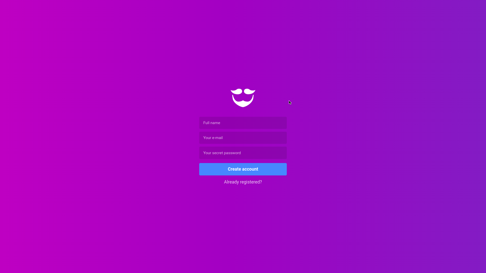
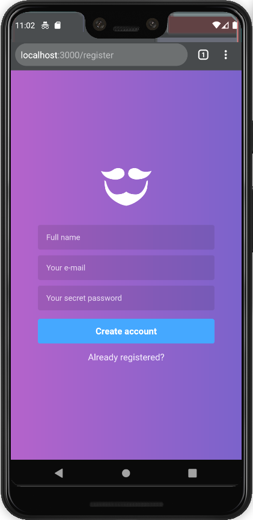

# GoBarber - Frontend
A React App created on Rocketseat's 9th Bootcamp module.

## Environment
- OS: Ubuntu 18.04
- Text editor: VS Code 1.38.1

## Tools
- Axios
- Datefns
- ESLint
- Immer
- Polished
- Prettier
- ReactJS
- React Icons
- Reactotron
- React Toastify
- Redux
- Redux Saga
- Styled Components
- Unform
- Yup

## Running the app:
To start the backend, you must use [this repository](https://github.com/v1eira/bootcamp-modulo-03) and run:
```bash
$ yarn dev
```

To run the mail queue, do:
```bash
$ yarn queue
```

Now start the application, using this repository, running:
```bash
$ yarn start
```

## Screens - Desktop





## Screens - Mobile
<p align="center">
    
</p>

<p align="center">
    
</p>

<p align="center">
    
</p>

<p align="center">
    
</p>
