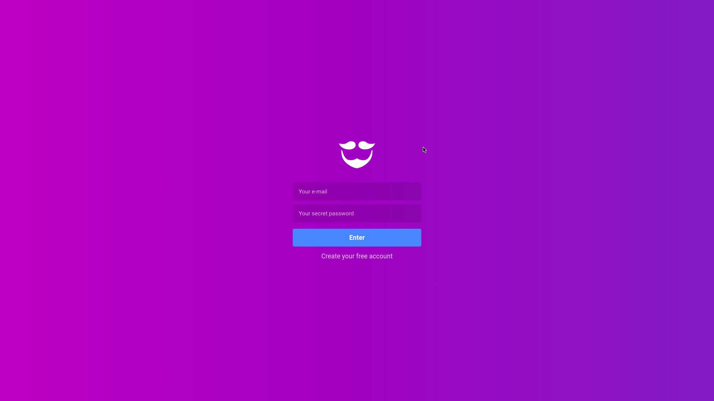
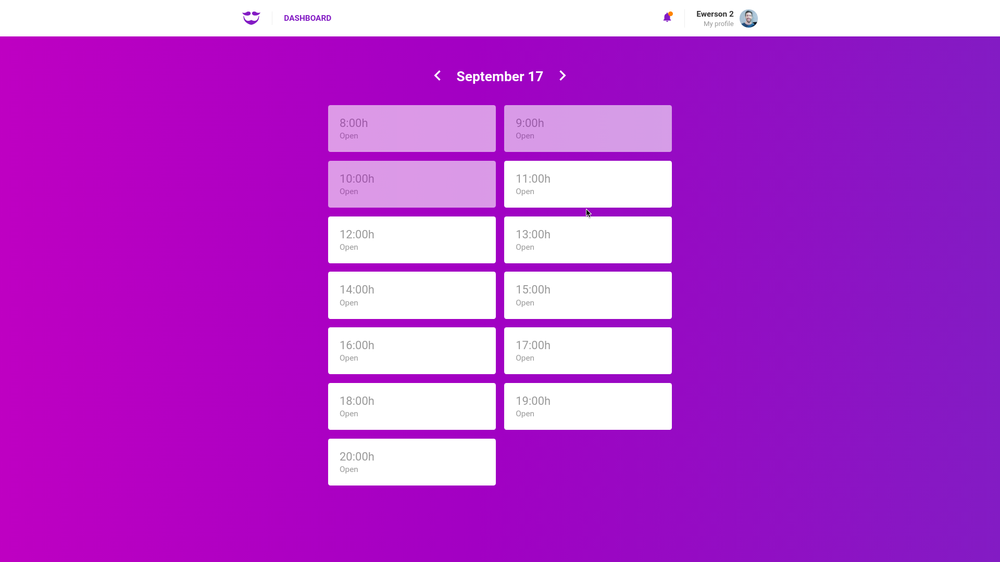
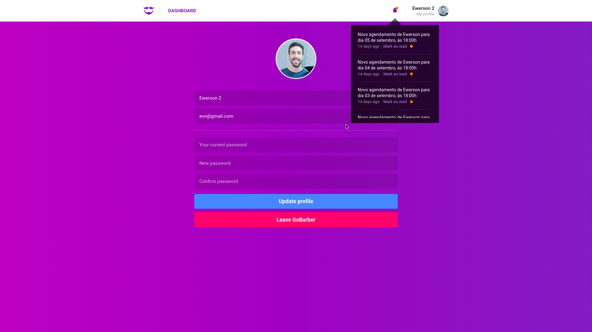
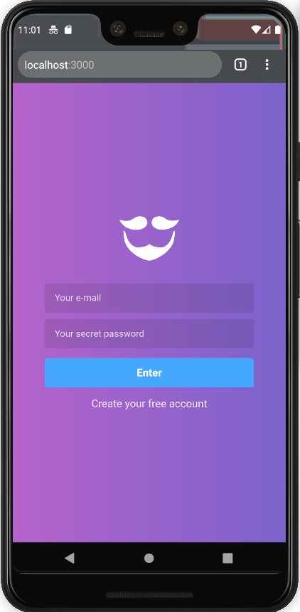
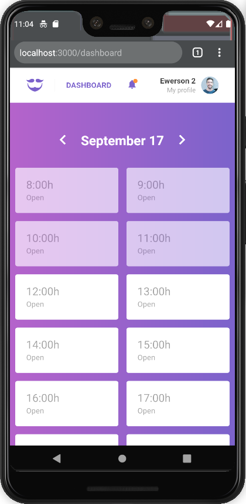
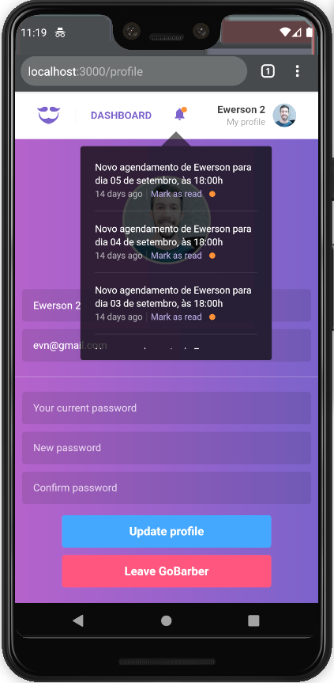

<p align="center">
   
</p>

# GoBarber

> A React App created on Rocketseat's 9th Bootcamp module to manage appointments in barber shops

---

# :wrench: Stack

This project was created using [React](https://reactjs.org/) and [Styled Components](https://styled-components.com/).

# :construction_worker: Installation

**Once you have [Node.js](https://nodejs.org/en/download/) and [Yarn](https://yarnpkg.com/) installed, install the dependencies running:**

```bash
$ yarn
```

**Setup the API**

This project needs to interact with a server to receive and register data.

Check [GoBarber Backend](https://github.com/v1eira/https://github.com/v1eira/gobarber-backend) repository and follow the instructions in order to get it running in your machine.

# :rocket: Running the app

After doing the previous steps, inside the cloned repo folder run:

```bash
$ yarn start
```


# :memo: License

This project is under the [MIT license](https://github.com/v1eira/gobarber-frontend/blob/master/LICENSE).

# :computer: Screens






# :iphone: Screens
<div>
  
  
  
</div>
